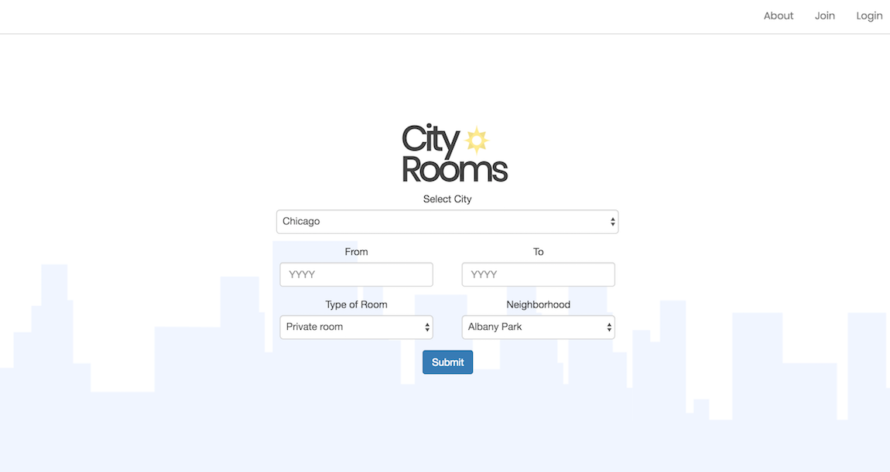
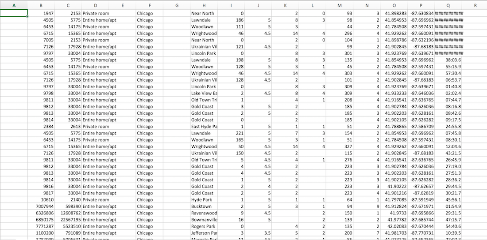

# City Rooms

### Synopsis

City Rooms is a web-based application where the user can research past data on Airbnb properties.  The initial input options allow the user to choose the two years from which they want to compare the data (2013 - 2017), select the type of listing (Shared Room, Private Room, Entire Home), and if they would like - choose the neighborhood of Chicago to focus on.  

### Motivation

Our idea originally started when we found a public data set of all Airbnb listings and thought an app that compared Airbnb and hotel prices in any given location would be extremely useful. However, we soon realized the scope of the project was too big and we decided to condense our idea.  We also were having difficulty finding hotel public data sets.  Since the Airbnb database was updated at least once every year since 2013, we realized we could create an app where the user can view and manipulate Airbnb prices in Chicago.  This information would probably be most useful to prospective real estate investors who are looking to purchase properties with the intention of renting them out as Airbnbs.  If one could see which neighborhoods in Chicago seem to have the quickest increase in pricing then they could have a good idea of where to invest in next.

### Code Example

Below is some example code from one of the routes.  This is a snippet of code taken from airbnb-api-routes.js.  As you can see the top half is code for getting the route for the type or room, and the bottom half is getting the route for the neighborhood.

    //get route for the room type
        app.get("/api/airbnb/:city/:year/:room", function(req, res){
        
        var year = req.params.year;
        var city = req.params.city;
        var room = req.params.room;
    
        db.Airbnb.findAll({
            where:{
                city: city,
                last_modified: {
                    $regexp:year
                },
                room_type: room
            }
        }).then(function(dbAirbnb){
            res.json(dbAirbnb);
        });
    });

    //get route for the neighborhood data
    app.get("/api/airbnb/neighborhoods/:city/:year/:neighborhood", function(req, res){
        
        var year = req.params.year;
        var city = req.params.city;
        var neighborhood = req.params.neighborhood;

        db.Airbnb.findAll({
            where:{
                city: city,
                last_modified: {
                    $regexp:year
                },
                neihborhood: neighborhood
            }
        }).then(function(dbAirbnb){
            res.json(dbAirbnb);
        });
    });

Below is an example of a few charts.  We used Chart.js to create these charts.  

*** Put chart images here ***

### Data Sets Used

The Chicago Listings from http://tomslee.net/category/airbnb-data.  The author of this site scraped data from all of the listings from Airbnb between 2013 and 2017.  Originally we intended on using New York and San Francisco but it was more than our available resources could handle.

This is an example of the data set we used.  Some of the columns were for room ID number, host ID number, neighborhood, price, and longitude and latitude coordinates.

### What's Next?

What's next for City Rooms?  There's several different ways we are looking to expand our idea.  One of the first additional features we are looking to add is using the Google Maps API to allow the user to see on a map the average change in price each year for every major neighborhood in Chicago.  This would allow the user to have an even better idea of where to invest if they are looking to become an Airbnb host.  

Another feature we would like to add is more cities.  Currently, we are focused on Chicago but eventually we are looking to add every major US city and eventually go international.  

Eventually, if we were able to find the needed public data sets for historical hotel pricings, we could come back to our original idea of being an app that would allow the user to compare hotel and Airbnb prices, not just for current listings, but ideally to compare prices since Airbnb begain in 2008.  We think this information could be very useful to forecast where things are headed in the hotel and room renting markets. 

### Built With

* Javascript + jQuery
* Material Design Lite
* Bootstrap
* Express.js
* Body-Parser
* Chart.js
* Handlebars
* MySQL
* Sequelize

### Authors

* Gary Marroquin
* Kiwon Nam
* Wilson Acosta
* Nick Dehmlow 

